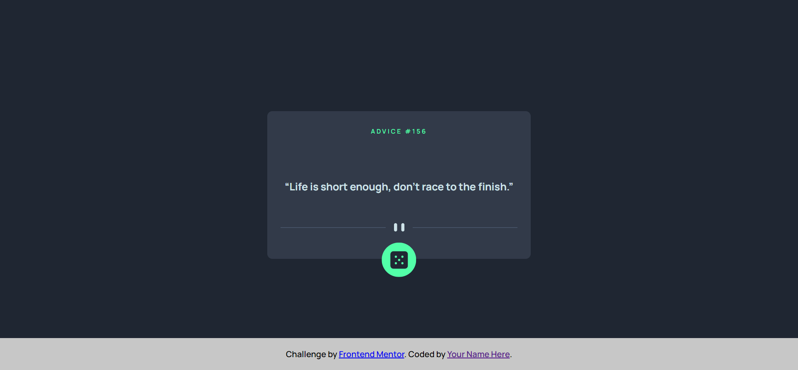

# Frontend Mentor - Advice generator app solution

This is a solution to the [Advice generator app challenge on Frontend Mentor](https://www.frontendmentor.io/challenges/advice-generator-app-QdUG-13db). Frontend Mentor challenges help you improve your coding skills by building realistic projects.

## Table of contents

- [Overview](#overview)
  - [The challenge](#the-challenge)
  - [Screenshot](#screenshot)
  - [Links](#links)
- [My process](#my-process)
  - [Built with](#built-with)
  - [What I learned](#what-i-learned)
  - [Continued development](#continued-development)
  - [Useful resources](#useful-resources)
- [Author](#author)
- [Acknowledgments](#acknowledgments)

## Overview

### The challenge

Users should be able to:

- View the optimal layout for the app depending on their device's screen size
- See hover states for all interactive elements on the page
- Generate a new piece of advice by clicking the dice icon

### Screenshot



### Links

- Solution URL: (https://github.com/FraneSpralja/advice-generator-app-main.git)
- Live Site URL: (https://franespralja.github.io/advice-generator-app-main/)

## My process

### Built with

- Semantic HTML5 markup
- CSS custom properties
- Flexbox
- CSS Grid
- JS vanilla

### What I learned

In this project I practiced async await function to fetch the api url. Also I worked with scripting in JS vanilla to build the HTML, using appendChild method.

I also like to work with flexbox, because later I have to use few @media query css to fix the mobile responsive.

```js
async function getAdvice() {
    const response = await fetch(`${url}`);
    const advice = await response.json();

    printAdvice(advice)
}
```

### Continued development

I want to continue learning more about JS Vanilla and also want to learn some framework, I think first I gonna center on Vue.js and the React.js

## Author

- Frontend Mentor - [@FraneSpralja](https://www.frontendmentor.io/profile/FraneSpralja)
- LinkedIn - [Frane Spralja](https://www.linkedin.com/in/frane-spralja-921ab772/)
